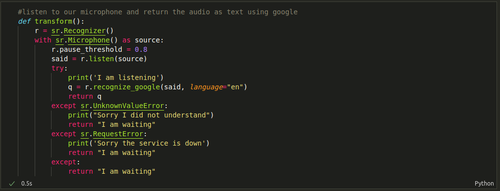
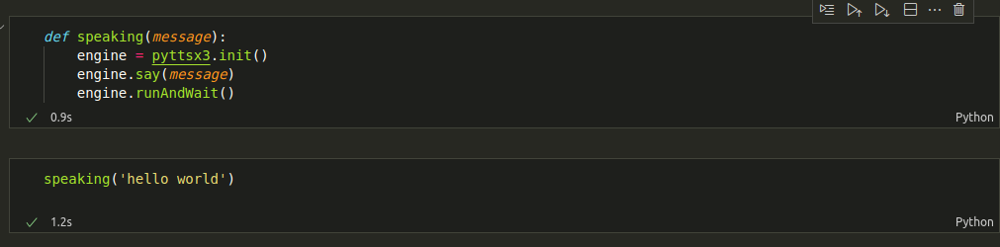
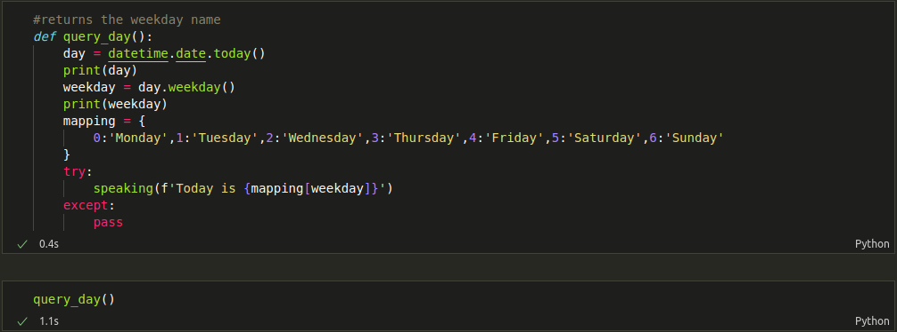
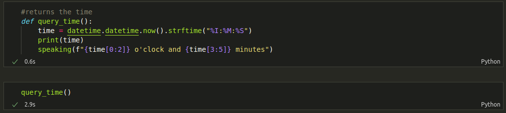
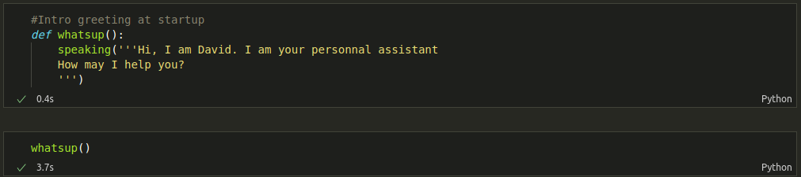

#  👋  VOICE ASSISTANT BOT ❕

🛠️A Virtual Assistant VA in python  :  Voice Chat Bot 🤖

## 👉 REQUIREMENTS 

- pip install pipwin
- pip install pyaudio
- pip install webbrowser 
- pip install pyttsx3
- pip install datetime 
- pip install pywhatkit
- pip install yfinance 
- pip install pyjokes
- pip install wikipedia 
- pip install 

### 👉 RUN PROJECT STEP BY STEP IN JUPYTER 

#### TRANSFORM ()

Listen to our microphone and return the audio as text using google 

#### SPEAKING ()

David Bot 🤖 speaks 

#### QUERY_DAY ()

David Bot 🤖 gives us weekday name 

#### QUERY_TIME ()

David Bot 🤖 gives us time 

#### WHATSUP ()

David Bot 🤖 says Hello and Greetings !

#### QUERYING ()

The heart of our Bot  Assistant 🤖 . Takes queries and returns answers !

